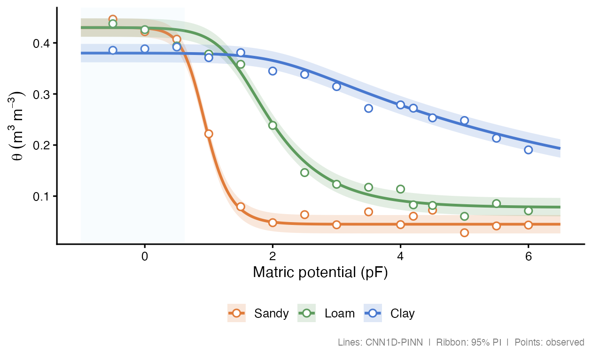

# soilFlux 

<!-- badges: start -->
[](https://github.com/HugoMachadoRodrigues/soilFlux/actions/workflows/R-CMD-check.yaml)
[](https://hugomachadorodrigues.github.io/soilFlux/)
[](https://lifecycle.r-lib.org/articles/stages.html#experimental)
[](https://opensource.org/licenses/MIT)
[](https://doi.org/10.5281/zenodo.18990856)
<!-- badges: end -->

> **Physics-informed CNN1D for estimating the complete soil water retention
> curve (SWRC) as a continuous, monotone function of matric potential.**

<p align="center">
  
</p>

---

## Overview

Classical pedotransfer functions (PTFs) predict volumetric water content (θ)
at a handful of fixed pressure heads — field capacity (pF 2.0), wilting point
(pF 4.2), etc. — leaving gaps between measurements and offering no guarantee
of physical consistency.

**soilFlux** fills the entire curve. Given a soil sample described by texture
fractions, organic carbon, bulk density, and depth, the model returns θ at
*any* pF value in \[−2, 7.6\], with four physics constraints baked into the
loss function and strict monotonicity guaranteed *by architecture*.

---

## Why not Van Genuchten?

The Van Genuchten (1980) equation is the standard parametric SWRC model:

$$\theta(h) = \theta_r + \frac{\theta_s - \theta_r}{\left[1 + (\alpha\,h)^n\right]^{1-1/n}}$$

where *h* = matric potential (cm), θ_r = residual water content, θ_s =
saturated water content, α = inverse air-entry pressure, and *n* = pore-size
distribution index.

Fitting VG requires **measured data at several pressure heads per sample** and
a nonlinear optimiser — and the parametric form can still violate monotonicity
near the wet end. soilFlux replaces parameter fitting with a single forward
pass through a trained neural network:

$$\hat{\theta}(\text{pF}) = \theta_s - \int_0^{\text{pF}} \text{softplus}\!\bigl(s(t)\bigr)\,dt$$

where $s(t)$ is a Conv1D output and softplus > 0 everywhere, so the integral
is strictly increasing and $\hat{\theta}$ is **strictly decreasing** —
*monotonicity is a structural property, not a post-processing step.*

| | Van Genuchten | Norouzi et al. (MLP-PINN) | soilFlux (CNN1D-PINN) |
|---|---|---|---|
| **Inputs** | Measured θ at ≥ 4 pressure heads | Texture, OC, BD, depth | Texture, OC, BD, depth |
| **Outputs** | θ at *any* h (after fitting) | θ at *any* pF (direct inference) | θ at *any* pF (direct inference) |
| **Backbone** | — | MLP | **Conv1D** |
| **Monotonicity** | Not guaranteed | ✅ By architecture | ✅ By architecture |
| **Physics constraints** | None | ✅ 4 residual constraints | ✅ 4 residual constraints (adapted) |
| **New samples** | Re-fit required | Single forward pass | Single forward pass |
| **Uncertainty** | Delta method / bootstrap | — | Prediction interval via ensemble |

---

## Architecture

Norouzi et al. (2025) proposed their physics-informed approach using a
**multi-layer perceptron (MLP)** as the backbone. **soilFlux replaces the MLP
with a one-dimensional convolutional network (Conv1D)**, treating the pF axis
as an ordered sequence and letting the convolutional filters learn local
curvature patterns along the retention curve.

<table>
<tr>
<td width="55%">

The model takes a 3-D input tensor of shape `[N, K, p+1]`, where *K* = 64
knot positions uniformly spaced across the pF domain and *p* = number of soil
covariates. A stack of Conv1D layers produces slope values at each knot; these
are passed through `softplus` and integrated via the trapezoidal rule to
produce the monotone SWRC output:

$$\hat{\theta}(\text{pF}) = \theta_s - \sum_{k=1}^{K} \text{softplus}(s_k)\,\Delta t_k$$

The saturated water content θ_s is predicted separately from a shallow branch
of the network and subtracted, so the curve anchors correctly at both the wet
plateau (pF ≈ −2) and the oven-dry end (pF = 7.6).

</td>
<td width="45%" align="center">

```
Soil covariates (p)
      │
   Broadcast ──► [N, K, p+1]
      │
   Conv1D × 3
      │
   softplus  ──► slopes ≥ 0
      │
   cumsum    ──► monotone integral
      │
   θ_s  ─────►  θ̂(pF) = θ_s − ∫ slope dt
```

</td>
</tr>
</table>

---

## Loss function (adapted from Norouzi et al. 2025)

The loss function design — the wet/dry data split and all four physics residual
constraints (S1–S4) — is adapted directly from Norouzi et al. (2025). The CNN1D
backbone described above replaces their original MLP.

The total training loss combines a **data term** and four **physics residual
terms**, each weighted by a tunable λ:

$$\mathcal{L} = \underbrace{\lambda_1 \mathcal{L}_{\text{wet}} + \lambda_2 \mathcal{L}_{\text{dry}}}_{\text{data loss}} + \underbrace{\lambda_3 \mathcal{L}_{S1} + \lambda_4 \mathcal{L}_{S2} + \lambda_5 \mathcal{L}_{S3} + \lambda_6 \mathcal{L}_{S4}}_{\text{physics loss}}$$

### Data loss

The observed data are split at pF = 4.2 (wilting point) and weighted
separately to balance the large dynamic range of the curve:

$$\mathcal{L}_{\text{wet}} = \frac{1}{N_w}\sum_{i \in \text{wet}} \bigl(\hat\theta_i - \theta_i\bigr)^2, \qquad \mathcal{L}_{\text{dry}} = \frac{1}{N_d}\sum_{i \in \text{dry}} \bigl(\hat\theta_i - \theta_i\bigr)^2$$

with λ₁ = 1, λ₂ = 10 — the dry end is up-weighted because observed values
are close to zero and small absolute errors carry proportionally more weight.

### Physics residuals

Collocation points {$t_j$} are sampled from each constraint domain at each
training step. Gradients are computed via automatic differentiation
(TensorFlow `GradientTape`).

**S1 — Linear dry end** &nbsp; (domain: pF ∈ [5.0, 7.6], λ₃ = 1)

$$\mathcal{L}_{S1} = \frac{1}{M}\sum_{j} \left(\frac{\partial^2\hat\theta}{\partial \mathrm{pF}^2}\bigg|_{t_j}\right)^{2}$$

**S2 — Non-negativity** &nbsp; (domain: pF = 6.2, λ₄ = 1 000)

$$\mathcal{L}_{S2} = \max\!\bigl(0,\,-\hat\theta(6.2)\bigr)^2$$

**S3 — Non-positivity** &nbsp; (domain: pF = 7.6, λ₅ = 1 000)

$$\mathcal{L}_{S3} = \max\!\bigl(0,\,\hat\theta(7.6)\bigr)^2$$

**S4 — Saturated plateau** &nbsp; (domain: pF ∈ [−2.0, −0.3], λ₆ = 1)

$$\mathcal{L}_{S4} = \frac{1}{M}\sum_{j} \left(\frac{\partial\hat\theta}{\partial \mathrm{pF}}\bigg|_{t_j}\right)^{2}$$

**S1** enforces that the curve becomes a straight line at the dry end (orange
region) — the most visible structural difference from Van Genuchten, which
continues to curve smoothly all the way to the dry end (compare solid vs.
dashed lines in the figure above). **S2/S3** act as hard barriers that prevent
the network from predicting negative or positive water content at the physical
bounds. **S4** penalises any slope in the saturated plateau (blue region).

The default weights are accessed via `norouzi_lambdas("norouzi")`; a smoother
dry end uses `norouzi_lambdas("smooth")` (λ₃ = 10).

---

## Performance

<p align="center">
  
</p>

Typical performance on held-out test pedons across texture classes:

| Metric | Value |
|--------|-------|
| R² | ≥ 0.97 |
| RMSE | < 0.030 m³ m⁻³ |
| MAE  | < 0.020 m³ m⁻³ |
| Bias | < 0.005 m³ m⁻³ |

Results vary with dataset size, texture distribution, and number of training
epochs. See the [package vignette](https://hugomachadorodrigues.github.io/soilFlux/articles/introduction.html)
for a reproducible workflow.

---

## Installation

```r
# Install from GitHub (development version)
remotes::install_github("HugoMachadoRodrigues/soilFlux")

# Install TensorFlow/Keras backend (once per machine)
tensorflow::install_tensorflow()
```

**System requirements:** R ≥ 4.1, Python ≥ 3.8, TensorFlow ≥ 2.14, keras3.

---

## Quick start

```r
library(soilFlux)

# 1. Prepare data ──────────────────────────────────────────────────────────
data("swrc_example")
df <- prepare_swrc_data(swrc_example, depth_col = "depth")

ids     <- unique(df$PEDON_ID)
set.seed(42)
tr_ids  <- sample(ids, floor(0.70 * length(ids)))
val_ids <- sample(setdiff(ids, tr_ids), floor(0.15 * length(ids)))
te_ids  <- setdiff(ids, c(tr_ids, val_ids))

train_df <- df[df$PEDON_ID %in% tr_ids,  ]
val_df   <- df[df$PEDON_ID %in% val_ids, ]
test_df  <- df[df$PEDON_ID %in% te_ids,  ]

# 2. Fit model ─────────────────────────────────────────────────────────────
fit <- fit_swrc(
  train_df = train_df,
  x_inputs = c("clay", "silt", "bd_gcm3", "soc", "Depth_num"),
  val_df   = val_df,
  epochs   = 80,
  lambdas  = norouzi_lambdas("norouzi"),
  verbose  = TRUE
)

# 3. Evaluate on test set ──────────────────────────────────────────────────
evaluate_swrc(fit, test_df)
#> # A tibble: 1 × 4
#>      R2   RMSE    MAE   Bias
#>   <dbl>  <dbl>  <dbl>  <dbl>
#> 1 0.974 0.0241 0.0163 0.0012

# 4. Predict the full continuous curve ─────────────────────────────────────
dense <- predict_swrc_dense(fit, newdata = test_df, n_points = 500)

# 5. Plot ──────────────────────────────────────────────────────────────────
plot_swrc(dense, obs_points = test_df,
          obs_col   = "theta_n",
          facet_row = "Depth_label",
          facet_col = "Texture")
```

---

## Main functions

| Function | Purpose |
|---|---|
| `prepare_swrc_data()` | Standardise raw soil data for modelling |
| `fit_swrc()` | Train the CNN1D-PINN |
| `predict_swrc()` | Predict θ at specific pF / head values |
| `predict_swrc_dense()` | Predict full continuous SWRC curves |
| `predict_theta_s()` | Extract modelled saturated water content |
| `evaluate_swrc()` | R², RMSE, MAE, Bias on a test set |
| `swrc_metrics()` | Per-pedon regression metrics |
| `norouzi_lambdas()` | Default loss-weight configurations |
| `build_residual_sets()` | Physics collocation points |
| `save_swrc_model()` / `load_swrc_model()` | Persist and reload trained models |
| `plot_swrc()` | Continuous SWRC curve figure |
| `plot_pred_obs()` | Predicted vs. observed scatter |
| `plot_swrc_metrics()` | Metric comparison bar chart |
| `plot_training_history()` | Training and validation loss curves |
| `classify_texture()` / `texture_triangle()` | USDA texture classification |

Full reference: [hugomachadorodrigues.github.io/soilFlux](https://hugomachadorodrigues.github.io/soilFlux/reference/index.html)

---

## Citation

If you use soilFlux, please cite:

**Package:**

> Rodrigues, H. (2026). *soilFlux: Physics-Informed Neural Networks for Soil
> Water Retention Curves*. R package version 0.1.1.
> <https://doi.org/10.5281/zenodo.18990856>

**Original architecture:**

> Norouzi, A. M., Feyereisen, G. W., Papanicolaou, A. N., & Wilson, C. G.
> (2025). Physics-Informed Neural Networks for Estimating a Continuous Form
> of the Soil Water Retention Curve. *Journal of Hydrology*.

```r
citation("soilFlux")
```

---

## License

MIT © 2026 Hugo Rodrigues
